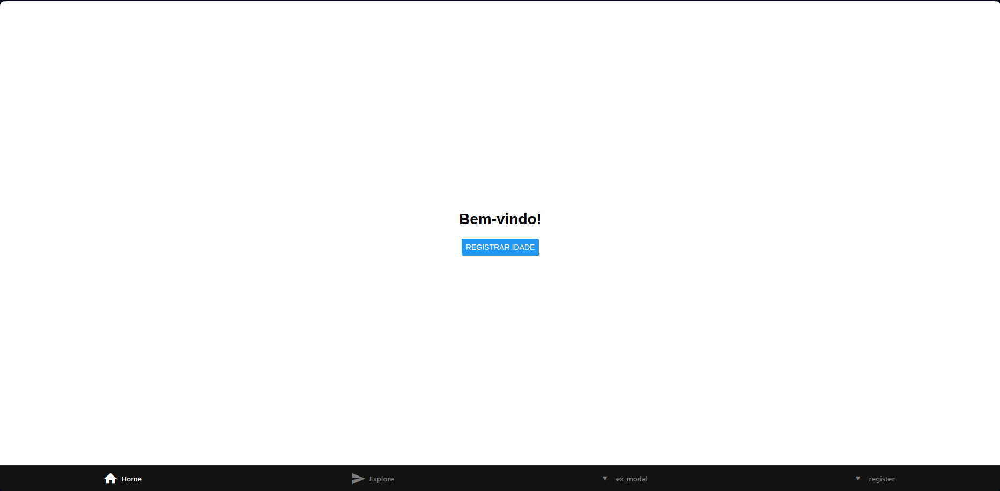
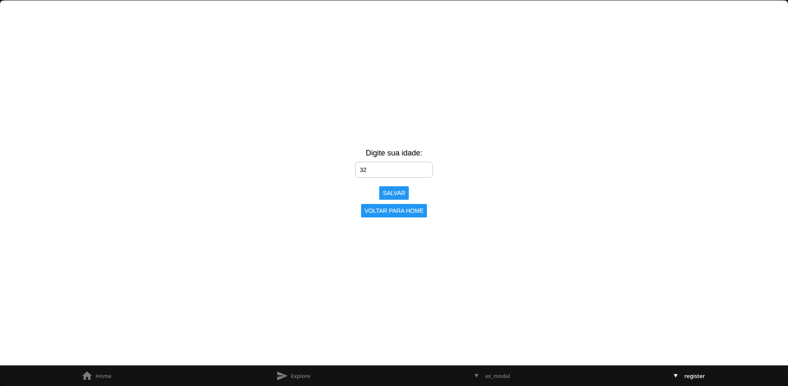
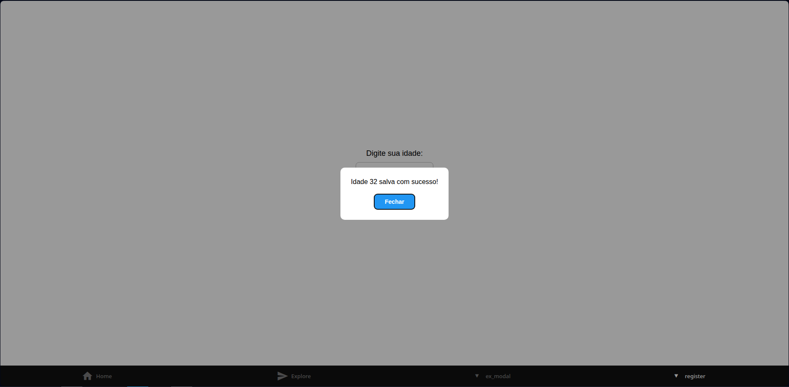
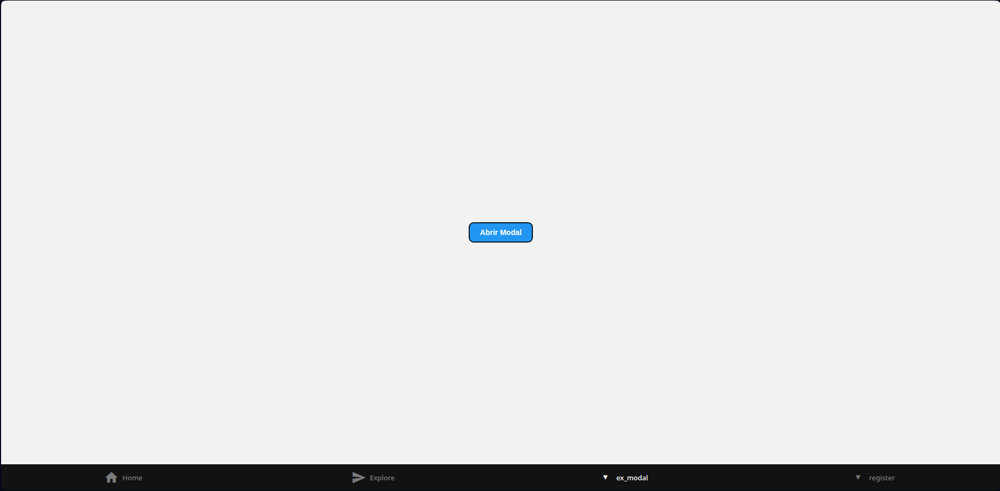
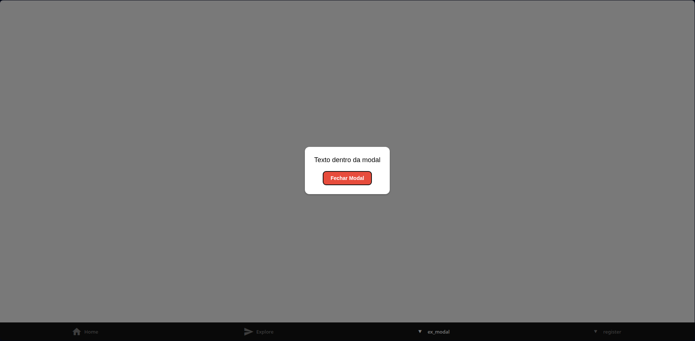

# 📱 Bem-vindo ao exercicios de mobile
Este repositório contém uma coleção de exercícios práticos desenvolvidos durante as sessões de estudo de **React Native** utilizando **npx expo**.  
Cada atividade possui seu próprio arquivo `.tsx` (ou múltiplos, quando necessário), e demonstra conceitos fundamentais do desenvolvimento mobile com React Native.

---

## 🧭 Sumário
- [Apresentação](#apresentação)
- [Trabalho 1 - Aplicativo: Registro de Idade](#trabalho-1---aplicativo-registro-de-idade)
- [Exemplo de Modal](#exemplo-de-modal)

---

## 🪪 Apresentação

Este projeto faz parte das sessões práticas de React Native, com foco em:
- Criação de telas e navegação usando **Expo Router**
- Manipulação de **estados e inputs**
- Exibição de **alertas e modais**
- Aplicação de **estilos com StyleSheet**

Cada exercício tem uma breve explicação e imagens representando o resultado visual.

---

## 🧩 Trabalho 1 - Aplicativo: Registro de Idade

### 🖼️ Imagem da Tela

---

### 📋 Descrição do Exercício

> **Instruções:**
> - Criar uma tela **Home** com uma mensagem de boas-vindas e um botão que leva para uma tela secundária.  
> - A tela secundária será a tela de **dados**.  
> - Inserir um **texto** pedindo para o usuário digitar a idade.  
> - Adicionar um **input** para inserir a idade.  
> - Criar um **botão “Salvar”** que, ao ser clicado, exibe a idade em um **alerta/modal**.  
> - Incluir um **botão “Voltar”** para retornar à tela principal.

---

### 📱 Telas do Aplicativo

#### 🏠 Tela Home

#### 🧍 Tela de Registro

---

### 🧠 Conceitos Aplicados
- Componentes funcionais
- Uso de `useState`
- Navegação com `expo-router`
- Exibição de modal (`Modal`, `Pressable`)
- Estilização com `StyleSheet`

---

## 🪟 Exemplo de Modal

### 🖼️ Imagem do Modal

---

### 📋 Descrição

Este exemplo demonstra o funcionamento básico de um **modal** no React Native, utilizando os componentes `Modal`, `Pressable` e `StyleSheet`.

O usuário pode abrir e fechar o modal clicando em botões, e o fundo fica levemente escurecido enquanto o modal está ativo.

---

### 🧠 Conceitos Aplicados
- Uso de estado (`useState`) para controlar a visibilidade
- Animação `slide` no modal
- Fundo translúcido com `rgba`
- Botões estilizados para abrir e fechar

---